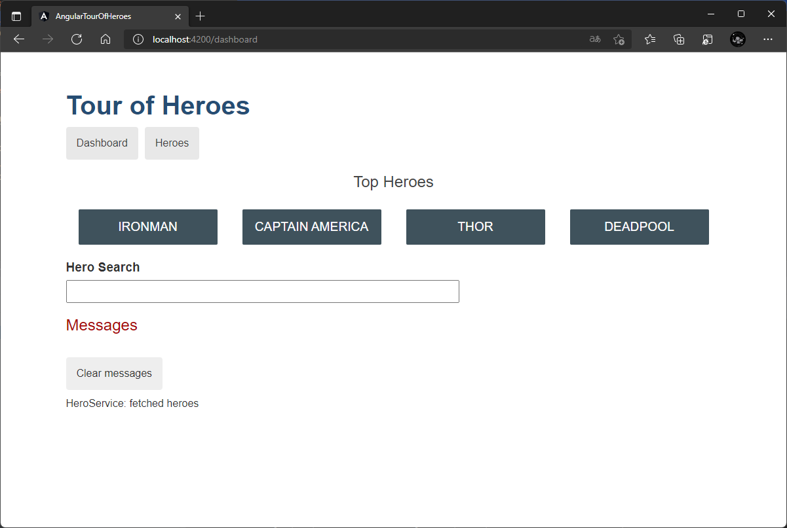
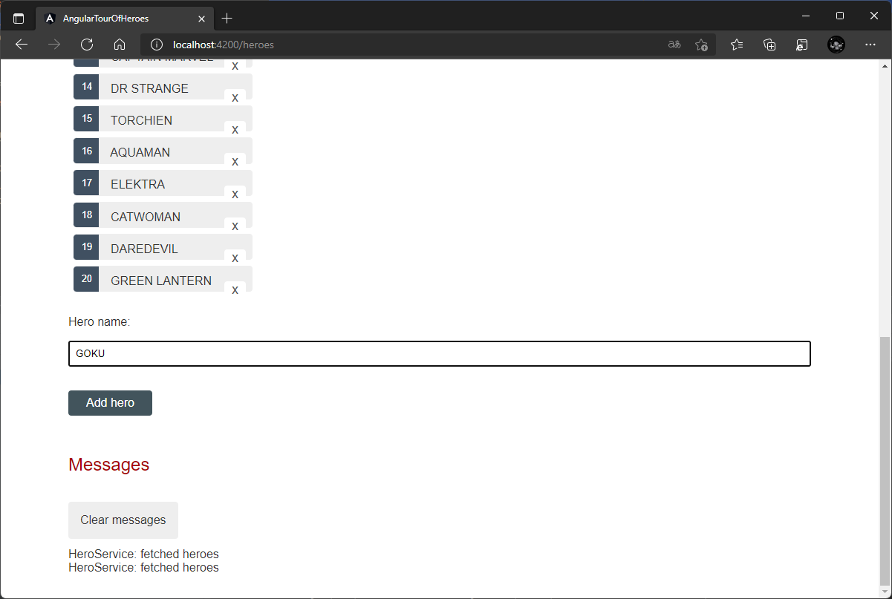
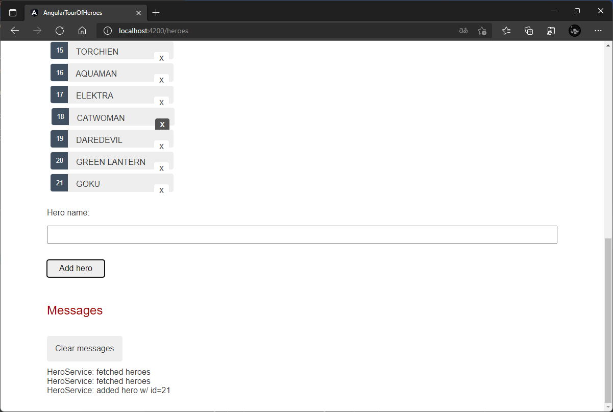
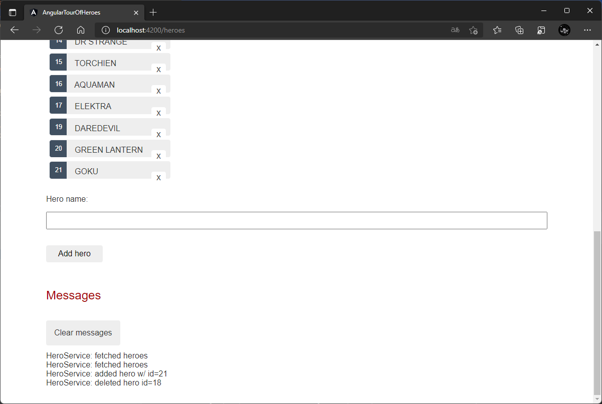

# Tour of Heroes
To deploy this project on Docker, you need to run the following command:

```
docker-compose up
```


--- 

### How to test this?

1. Install Docker Compose 
2. Clone this repository 
3. Update your profile to use the Docker Compose file 
4. Run all containers with docker-compose up 
5. Verify in Datadog that your container is running backend, frontend and database

--- 




